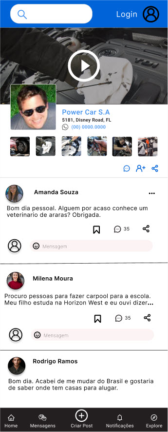

# Pagina principal sem cadastro

A pagina principal sem cadastro mostra o feed principal, mas o usuário nao tem direito de fazer comentarios.
Todos os campos e botoes sao desabilitados.

### Icone usuario 

O icone do usuario aparece vazio. Uma vez clicado, o pop up de [login](../../../popups/login/login.md) aparece.

### Campo de Pesquisa

O campo de pesquisa leva ate a pagina de
[Busca de Servicos ](../../busca_de_servicos/busca_de_servicos.md).

### Tres pontos

Os tres pontos aparecem desabilitados ou nao aparecem.

### Link para outros usuarios

O usuario sem cadastro tem o direito de visualizar o perfil de outros usuários e servicos.

