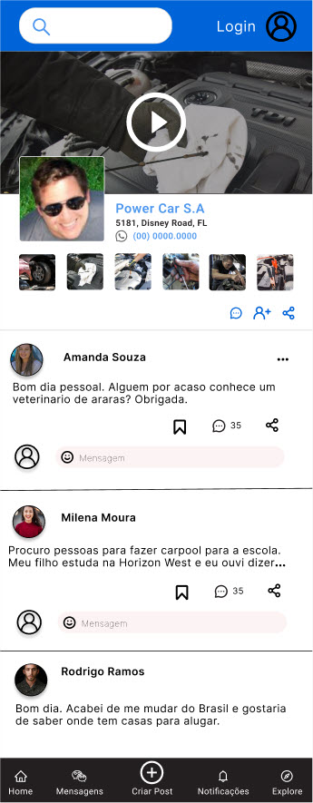
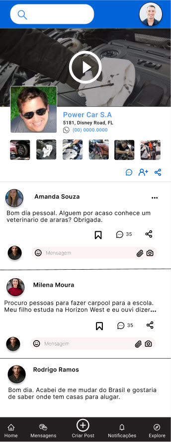

# Pagina principal

A pagina principal eh acessada a partir da url www.ararabrazil.com ou atraves do QR code da empresa, e 
esta disponivel para usuarios com ou sem cadastro.

A diferenca entre as duas paginas eh que o usuario sem cadastro nao pode mandar mensagens para 
outros participantes.

## [Pagina Principal Sem Cadastro](usuario_sem_cadastro/usuario_sem_cadastro.md)

Mesmo sem ter cadastro, a pessoa que tiver curiosidade pode acessar a plataforma. Area de mensagens eh desabilitada.

  

## Detalhes da pagina principal:

### Cabecalho

- Campo de busca - Ao clicar, abre-se a pagina de busca.
- Icone Sign Up/Log In - Ao clicar, abre-se a pagina de login.

### Propaganda

A propaganda pode ter videos ou apenas fotos. Ao clicar, a midia ira se abrir num popup.
* Campo obrigatorio: Nome do servico.
* Campos opcionais: Endereco(s), contatos.

Ao clicar na figura menor ou no nome do servico, o usuario sera direcionado a pagina do servico.   
Ao clicar no Whatsapp do servico, o whatsapp ira se abrir no celular do usuario.  
Ao clicar no icone de mensagem ou adicionar servico, o usuario sera direcionado a pagina de login.  
Ao clicar no icone de compartilhar, um popup ira se abrir com opcoes de compartilhamento (Whatsapp, Instagram, Facebook, Copiar link).

### Posts de usuarios

O post do usuario eh composto de:

* Foto do usuario - Ao clicar, abre-se a pagina daquele usuario
* Nome do usuario - Ao clicar, abre-se a pagina daquele usuario
* Tres pontos (flag de comportamento indevido) - O post sera enviado a administracao
* Bookmark - Ao clicar, abre-se a pagina de login.
* Thead de mensagens - Abre-se o thread de mensagens
* Compartilhamento do post - Um popup ira se abrir com opcoes de compartilhamento (Whatsapp, Instagram, Facebook, Copiar link).
* Icone de login - Ao clicar, abre-se a pagina de login.
* Campo de mensagem - Desabilitado.

### Rodape

O Rodape possui cinco icones:

* Home - Ao clicar, o usuario sera direcionado ao feed principal
* Mensagens - Desabilitado
* Criar Post - Desabilitado
* Notificacoes - Desabilitado
* Explore - Ao clicar, o usuario sera direcionado a pagina de Explore

  

  
  

 

div>

## [Pagina Principal Com Cadastro](usuario_com_cadastro/usuario_com_cadastro.md)

O usuario cadastrado tem total acesso a todos os recursos da plataforma.

  

## Detalhes da pagina principal:

### Cabecalho

- Foto do perfil - Ao clicar, abre-se a pagina pessoal.
- Campo de busca - Ao clicar, abre-se a pagina de busca.
- Icone de alerta - Ao clicar, abre-se a pagina de alertas.

### Separador

### Propaganda

- Foto do perfil - Ao clicar, abre-se a pagina do servico
- Nome do servico - Ao clicar, abre-se a pagina do servico
- tres pontos - Red flag.
- Descricao
- Fotos e videos do servico - Ao clicar, abre-se um popup, seja foto, seja video.
- Icone de adicionar servico - Ao clicar, o icone muda de cor, uma mensagem aparece informando que o servico foi salvo, e o servico eh salvo na lista de servicos.
- Icone de compartilhar servico - Ao clicar, um popup mostra como compartilhar o servico (Whatsapp, Facebook, Instagram, Copiar Link)
- Foto do perfil - Ao clicar, abre-se a pagina pessoal.
- Area de mensagem ao profissional. Ao clicar, abre-se o teclado virtual.  
Uma vez que a mensagem eh enviada, pode-se acessa-la atraves da pagina de mensagens ou do icone de mensagens no topo direito da tela.
- Icone de attachment. Caso a pessoa queira enviar uma imagem ao profissional.
- Icone de camera. Caso a pessoa queira enviar uma foto live ao profissional.

### Separador

### Mensagem de usuario

- Foto do usuario
- Nome do usuario
- Tres pontos - Red flag.
- Mensagem do usuario
- Icone de coracao. Ao clicar, o icone muda de cor e a mensagem eh salva no perfil pessoal.
- Icone de mensagem. Ao clicar, abre-se a thread de mensagem com a possibilidade de participar da thread.
- Icone de adicionar usuario - Ao clicar, o icone muda de cor e o usuario eh incluido na lista de contatos.
- Icone de compartilhar thread - Ao clicar, um popup mostra como compartilhar a thread (Whatsapp, Facebook, Instagram, Copiar Link)

### Separador

### Rodape

  

  

   

div>