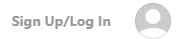

# Pagina de login

A pagina de login aparece nas seguintes ocasiões. 
 * O usuario nao logado clica no icone de usuario sem cadastro 
 * O usuario nao logado clica em 'Cadastrar/Log In' no topo direito da pagina  

A pagina de login eh um pop up que aparece na frente da pagina corrente. 

